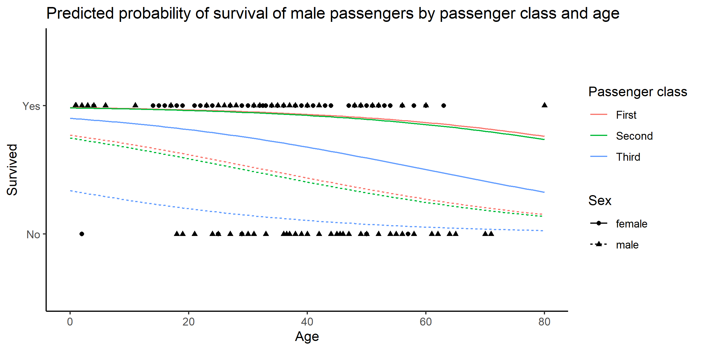

# First individual Git lab exercise
Here is a graph that resulted from the ggsave() command added to the end of [titanic.R](titanic.R)

## About the exercise
In this lab exercise I learned:
- how a GitHub Classroom assignment works
- some basic Git actions:
  - **clone** a repository from a remote to my device
  - create and name a **branch**
  - **add** (i.e. stage) files
  - **commit** changes
  - **push** commits to the remote repository
- what **ggsave()** (an R command) basically does
- that R saves workspace data in an RData file
- the importance of making frequent commits
- to use a README file (and Markdown) to describe a repository
